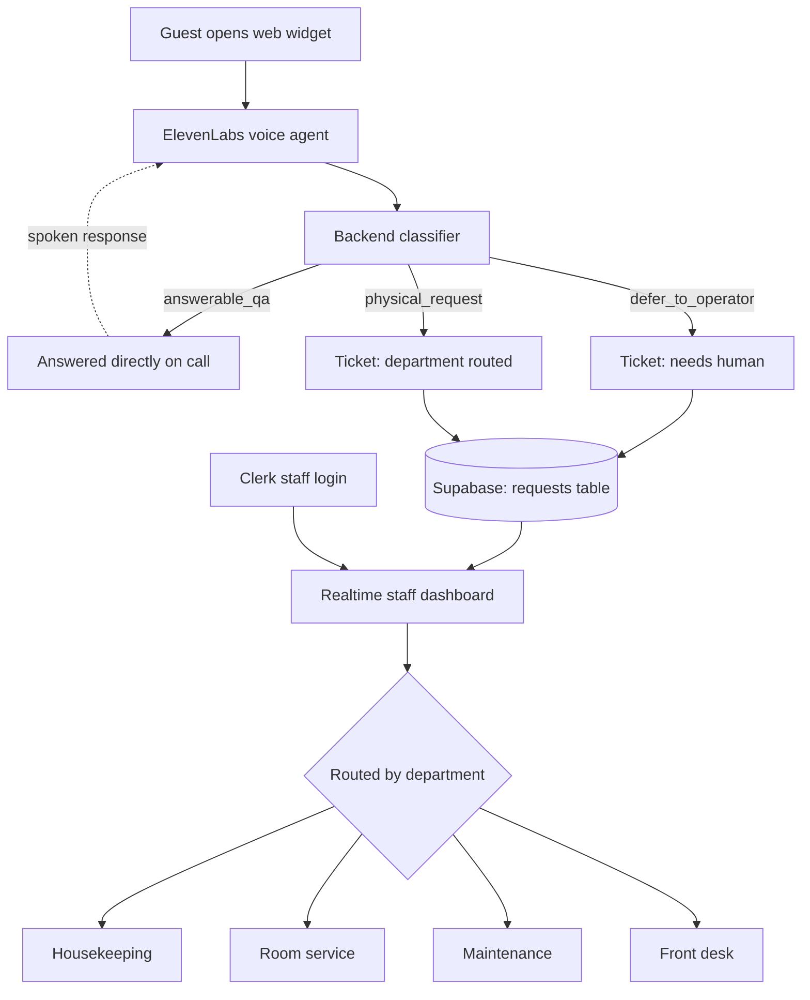

## Architecture

```mermaid
flowchart TD
    A[Guest opens web widget] --> B[ElevenLabs voice agent]
    B --> C[Backend classifier]
    C -->|answerable_qa| D[Answered directly on call]
    D -.->|spoken response| B
    C -->|defer_to_operator| E[Ticket: needs human]
    C -->|physical_request| F[Ticket: department routed]
    E --> G[(Supabase: requests table)]
    F --> G
    G --> H[Realtime staff dashboard]
    I[Clerk staff login] --> H
    H --> J{Routed by department}
    J --> K[Housekeeping]
    J --> L[Room service]
    J --> M[Maintenance]
    J --> N[Front desk]
```