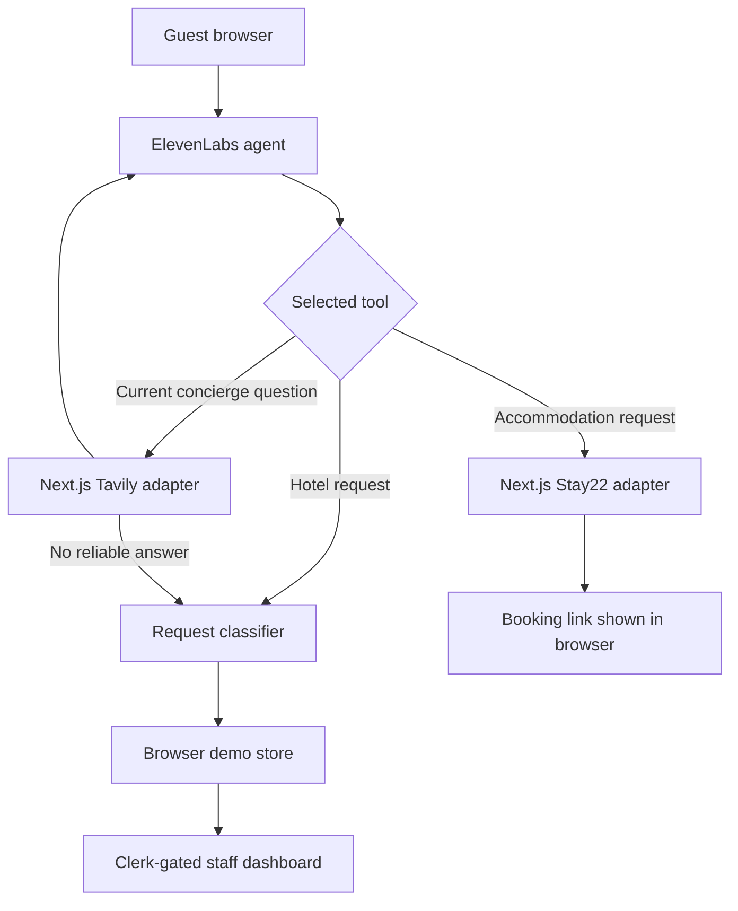

# Landline Demo Architecture

Landline is a single-browser hotel voice-agent demo. It demonstrates a guest
request moving from an ElevenLabs conversation to a Clerk-gated staff
dashboard without operating a production backend or shared database.

## Product boundary

The supported demo loop is:

1. A guest speaks to the ElevenLabs agent or submits the manual demo request.
2. Landline classifies the request and selects a staff department.
3. The browser saves the normalized ticket locally.
4. A Clerk-authenticated staff member opens the dashboard in the same browser.
5. The staff member picks up and completes the ticket.

Cross-browser synchronization, production persistence, PBX integration, real
staff presence, CRM integration, and production call recording are outside the
demo scope.

## System ownership

Each mutable fact has one owner.

| System | Owns | Must not own |
|---|---|---|
| Clerk | Staff authentication, display name, and role | Tickets, transcripts, or hotel content |
| Browser demo store | Tickets, assignments, statuses, demo call logs, and displayed travel recommendations | Authentication or vendor secrets |
| Request classifier | Department routing and human-escalation rules | UI state or persistence |
| ElevenLabs | Live voice conversation, speech, language handling, and tool selection | Ticket persistence |
| Tavily adapter | Current external concierge search results and source links | Hotel policy or ticket state |
| Stay22 adapter | Accommodation search or tracked booking destinations | Reservations or locally stored inventory |
| Next.js route handlers | Secret handling, input validation, normalized vendor responses | Long-term persistence |

The browser demo store is the single writer for demo state. Dashboard components
read that state and request store operations; they do not keep independent
authoritative copies.

## Runtime flow

## Domain contract

The supported values are deliberately small and shared across classification,
storage, and presentation.

- Departments: `front_desk`, `housekeeping`, `room_service`, `maintenance`
- Ticket statuses: `new`, `in_progress`, `done`
- Intents: `answerable_qa`, `physical_request`, `defer_to_operator`
- Urgency: `low`, `medium`, `high`

The classifier recomputes `department` and `requires_human`; it does not trust
those values from an ElevenLabs tool payload.

## External service boundaries

### ElevenLabs

ElevenLabs remains the voice runtime. The browser requests a short-lived signed
conversation URL from a Next.js route so the API key stays server-only.
Property name, address, and coordinates are passed as dynamic variables.

Planned tools:

- `log_request`: validate, classify, normalize, and save a local ticket.
- `search_concierge`: request current external information through Tavily.
- `find_stays`: produce Stay22 accommodation results or a tracked destination.
- `defer_to_staff`: create a front-desk ticket when a tool cannot help safely.

### Tavily

Tavily is for facts that can change, such as nearby businesses, events,
transportation, and current opening information. The API key stays in the
server environment. Results returned to the agent include a concise answer and
source URLs. Failure or weak evidence must offer human escalation instead of a
guess.

Hotel-specific policies and amenities are deterministic demo content, not web
search results.

### Stay22

The first integration uses Stay22 Allez to produce a tracked accommodation
destination. The UI must describe it as a link to view stays, never as a
completed reservation. Live inventory must not be stored in the browser demo
store. A full accommodation-results adapter can be added later without
changing ticket ownership.

## Local persistence

The browser store will use one versioned `localStorage` record. It must:

- initialize seed data once;
- persist ticket status and assignment after refresh;
- validate stored data before use;
- recover to safe seed data when storage is invalid;
- support an explicit demo reset; and
- allow future schema migrations through a version field.

The same-browser constraint is intentional. A request made in one browser is
not expected to appear on another device.

## Failure behavior

- Missing ElevenLabs configuration: keep the manual demo request available.
- Tavily failure or no supported answer: offer or create a front-desk ticket.
- Stay22 failure: explain that booking options are unavailable; do not fabricate a link.
- Invalid local state: reset to validated seed data.
- Missing Clerk role: show the existing contact-an-admin state.

## Required environment

Core:

- `ELEVENLABS_API_KEY`
- `ELEVENLABS_AGENT_ID`
- `CLERK_SECRET_KEY`
- `NEXT_PUBLIC_CLERK_PUBLISHABLE_KEY`

Feature-specific:

- `TAVILY_API_KEY`
- `STAY22_AID`

The manual request and dashboard demo must remain usable when optional vendor
configuration is absent.

## Verification baseline

The completed demo must prove:

1. It installs, tests, and builds without Supabase, Python, pgvector, or Anthropic.
2. Clerk roles control the dashboard view.
3. A manual request completes the same-browser ticket workflow after refresh.
4. ElevenLabs can invoke each configured tool without exposing secret keys.
5. Tavily-backed answers include sources and fail safely.
6. Stay22 returns a valid tracked destination and never claims to book directly.
