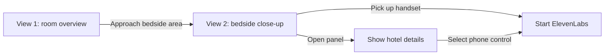

# Landline Guest Experience

This document is the design reference for Landline's in-room guest experience.
It defines what the guest sees, which actions are real, and where the existing
voice system begins. The staff dashboard remains a separate operational view.

## Experience goal

The guest page should feel like entering a hotel room, not configuring a web
application. A warm, stylized room illustration establishes the setting before
the guest approaches the bedside phone and control panel.

The visual direction is warm luxury editorial line art:

- warm cream walls and ivory bedding;
- walnut furniture and muted brass details;
- a charcoal or matte-black hotel phone;
- a low amber glow from the bedside panel; and
- soft shadows with restrained depth and motion.

The illustration is an original responsive SVG. It should remain intentionally
stylized rather than imitate a photograph.

## Guest flow

The guest flow has two views with one deliberate transition:

### View 1: room overview

View 1 is the guest landing page. It contains:

- a front-facing bed as the main visual element;
- a headboard, two nightstands, lamps, and restrained room details;
- a clearly recognizable hotel phone on the left nightstand; and
- a compact bedside panel beside or behind the phone.

The room fills the viewport. Landline is the only visible page label; welcome
copy, room metadata, introductory headings, captions, and explanatory text do
not compete with the scene. The phone and panel provide the visual invitation
to approach.

The bedside area is the future transition target for View 2. View 1 must not
start ElevenLabs. Until View 2 exists, View 1 does not expose a dead or
misleading interactive control.

The current property card, edit action, floating call button, and manual request
controls do not appear in this view. Their underlying code and demo data remain
available for later guest states and staff workflows.

### View 2: bedside close-up

View 2 will show the phone and panel at useful detail.

- Picking up the handset starts the ElevenLabs conversation.
- Selecting the panel displays hotel details on the panel screen.
- The panel visually mimics common bedside controls.
- Non-phone panel controls are visibly disabled and do not perform actions.
- The panel's phone control is the only enabled panel action and also starts
  ElevenLabs.
- A return control takes the guest back to the room overview.

View 2 is documented here for continuity but is not part of the first
implementation phase.

## Device conventions

The phone should resemble hotel hardware rather than a generic phone icon. It
uses a low cradle, a corded handset, a small faceplate, and a message-waiting
light. Later close-up detail can include a small set of service labels such as
Front Desk, Concierge, Housekeeping, Room Service, and Emergency.

The panel should resemble a compact tabletop or wall-mounted hotel controller.
Later close-up detail can show lighting, curtains, temperature, privacy, and
service controls, but those controls remain inactive in this demo. Disabled
controls must be represented as disabled controls, not as buttons that silently
fail.

## Interaction ownership

- The guest page owns the current visual view and approach transition.
- `usePhoneSession` continues to own the ElevenLabs browser conversation.
- ElevenLabs starts only from a deliberate phone action in View 2.
- The browser demo store continues to own tickets, calls, and recommendations.
- Clerk continues to own staff identity and dashboard access.
- View changes must not write tickets or alter staff dashboard state.

## Responsive behavior

- Use the wide, symmetrical room composition on desktop screens.
- Use a dedicated portrait composition on narrow screens instead of shrinking
  the entire wide room.
- In the portrait composition, keep the left nightstand, phone, and panel fully
  visible beside a large partial view of the bed.
- Crop the right nightstand and most decorative wall details before reducing the
  size of the primary objects.
- Fill the dynamic viewport height without horizontal scrolling.
- Avoid text embedded in the SVG when equivalent HTML can remain legible and
  accessible.

## Accessibility and motion

- Give the SVG a concise accessible title and description.
- Use real HTML buttons for future interactive hotspots.
- Provide visible keyboard focus and a minimum 44-by-44-pixel target.
- Do not communicate availability through color or a blinking light alone.
- Keep camera transitions brief and respect `prefers-reduced-motion`.

## Scope boundaries

This experience does not add a production phone system, PBX integration,
cross-device state, or a second persistence layer. It does not redesign the
staff dashboard. Tavily, Stay22, Clerk, the browser store, and the existing
ElevenLabs adapter remain within the boundaries in `architecture.md`.
