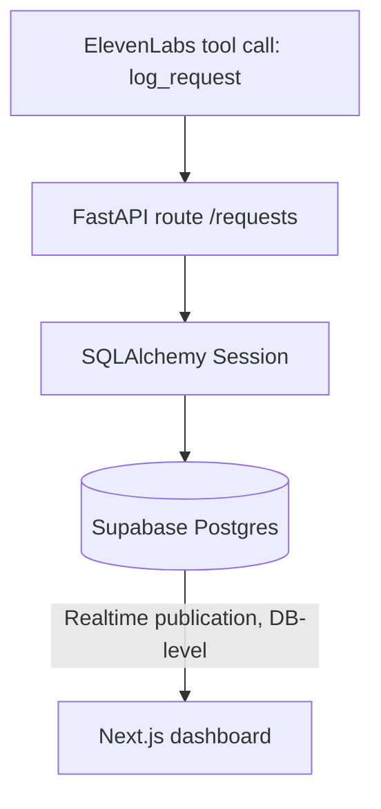

# SQLAlchemy usage map

## Where it fits in the pipeline



SQLAlchemy only sits between FastAPI and Postgres. It replaces raw SQL / the `supabase-py` client for writes — it does **not** touch the dashboard's read path, since that subscribes to Postgres changes directly via `supabase-js`.

## 1. Install

```bash
pip install sqlalchemy psycopg2-binary
```

## 2. `database.py` — engine + session

```python
from sqlalchemy import create_engine
from sqlalchemy.orm import sessionmaker, declarative_base

# Supabase gives you this connection string under Project Settings > Database
DATABASE_URL = "postgresql://postgres:[password]@[host]:5432/postgres"

engine = create_engine(DATABASE_URL, pool_pre_ping=True)
SessionLocal = sessionmaker(autocommit=False, autoflush=False, bind=engine)
Base = declarative_base()

def get_db():
    db = SessionLocal()
    try:
        yield db
    finally:
        db.close()
```

## 3. `models.py` — mirrors the existing schema

```python
import uuid
import enum
from sqlalchemy import Column, String, Text, Boolean, DateTime, ForeignKey, Enum
from sqlalchemy.dialects.postgresql import UUID
from sqlalchemy.sql import func
from database import Base

class Department(str, enum.Enum):
    housekeeping = "housekeeping"
    room_service = "room_service"
    maintenance = "maintenance"
    front_desk = "front_desk"

class IntentType(str, enum.Enum):
    answerable_qa = "answerable_qa"
    defer_to_operator = "defer_to_operator"
    physical_request = "physical_request"

class UrgencyLevel(str, enum.Enum):
    low = "low"
    medium = "medium"
    high = "high"

class RequestStatus(str, enum.Enum):
    new = "new"
    in_progress = "in_progress"
    done = "done"

class Room(Base):
    __tablename__ = "rooms"
    id = Column(UUID(as_uuid=True), primary_key=True, default=uuid.uuid4)
    room_number = Column(String, unique=True, nullable=False)
    language_pref = Column(String, default="en")
    created_at = Column(DateTime(timezone=True), server_default=func.now())

class Request(Base):
    __tablename__ = "requests"
    id = Column(UUID(as_uuid=True), primary_key=True, default=uuid.uuid4)
    room_number = Column(String, nullable=False)
    intent = Column(Enum(IntentType), nullable=False)
    department = Column(Enum(Department), nullable=True)
    summary = Column(Text, nullable=False)
    urgency = Column(Enum(UrgencyLevel), default=UrgencyLevel.low)
    language_detected = Column(String, default="en")
    status = Column(Enum(RequestStatus), default=RequestStatus.new)
    requires_human = Column(Boolean, default=False)
    created_at = Column(DateTime(timezone=True), server_default=func.now())
    updated_at = Column(DateTime(timezone=True), server_default=func.now(), onupdate=func.now())

class CallLog(Base):
    __tablename__ = "call_logs"
    id = Column(UUID(as_uuid=True), primary_key=True, default=uuid.uuid4)
    room_number = Column(String)
    transcript = Column(Text)
    request_id = Column(UUID(as_uuid=True), ForeignKey("requests.id"))
    created_at = Column(DateTime(timezone=True), server_default=func.now())
```

Note: since the tables already exist (created via the SQL DDL from the schema doc), you don't need `Base.metadata.create_all()` — these models just map onto what's already there. If you're starting fresh, running `create_all(bind=engine)` once will create them for you, but you'd still need to run the `alter publication supabase_realtime add table requests;` line manually since that's Supabase-specific, not something SQLAlchemy manages.

## 4. FastAPI route — the actual write path

```python
from fastapi import FastAPI, Depends
from sqlalchemy.orm import Session
from pydantic import BaseModel
from database import get_db
from models import Request, IntentType, Department, UrgencyLevel

app = FastAPI()

class LogRequestPayload(BaseModel):
    intent: IntentType
    room_number: str
    summary: str
    urgency: UrgencyLevel = UrgencyLevel.low
    language_detected: str = "en"
    department: Department | None = None

@app.post("/requests")
def log_request(payload: LogRequestPayload, db: Session = Depends(get_db)):
    if payload.intent == IntentType.answerable_qa:
        return {"status": "no ticket needed"}

    requires_human = payload.intent == IntentType.defer_to_operator
    department = Department.front_desk if requires_human else payload.department

    new_request = Request(
        room_number=payload.room_number,
        intent=payload.intent,
        department=department,
        summary=payload.summary,
        urgency=payload.urgency,
        language_detected=payload.language_detected,
        requires_human=requires_human,
    )
    db.add(new_request)
    db.commit()
    db.refresh(new_request)
    return {"status": "created", "id": str(new_request.id)}
```

That commit is what triggers Supabase Realtime — the moment the transaction lands in Postgres, the dashboard's subscription fires, regardless of the fact that SQLAlchemy (not `supabase-js`) made the write.

## 5. Migrations (optional, only if you have time)

For a one-day build, skip Alembic and just run your SQL DDL directly in the Supabase SQL editor once. If the team wants proper migrations anyway:

```bash
pip install alembic
alembic init alembic
# point alembic.ini / env.py at DATABASE_URL and Base.metadata
alembic revision --autogenerate -m "init schema"
alembic upgrade head
```